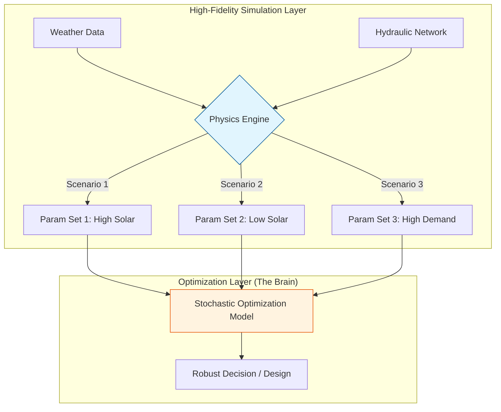
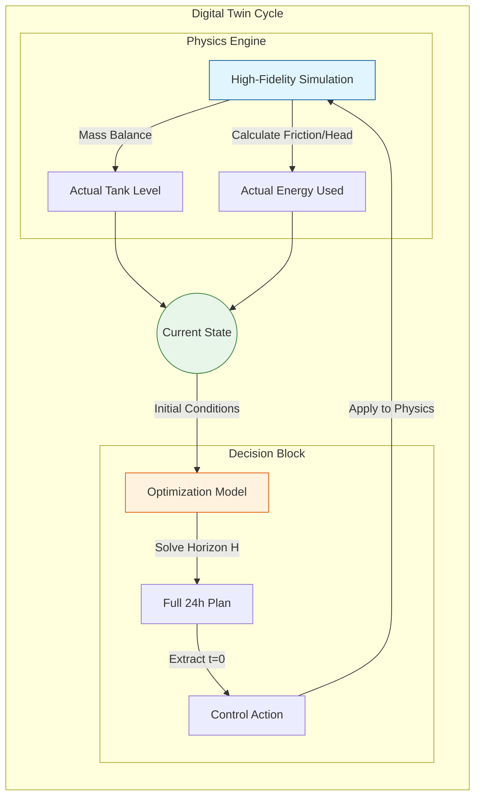

Here is a summary designed for your Digital Twin framework documentation. It integrates the concepts of high-fidelity physics, uncertainty handling, and the two primary architectural approaches.

---

# Integration Framework: Simulation-Optimization for Digital Twins

## 1. The Core Concept: "Brain" vs. "Reality"

In a Digital Twin for operations (like EcoNex), we must bridge the gap between strategic decision-making and physical reality.

* **The Optimization (The Brain):** A simplified, linear algebraic model (Pyomo). It makes decisions (how much to pump, store, or trade) to minimize cost/maximize efficiency. It assumes the world is "perfect" and linear.
* **The Simulation (The Reality):** A high-fidelity, non-linear physics engine (e.g., EPANET for water, PVLib for solar). It calculates the *actual* consequences of those decisions, respecting complex physical laws.

### How Simulation Handles High-Fidelity Physics

The simulation layer acts as a "Parameter Generator" for the optimization. It translates complex physics into the linear parameters (`D`, `k`, `eta`) that the optimization model can understand.

| Parameter in Opt Model | Physics Handled by Simulation |
| --- | --- |
| **Pumping Intensity (`k`)** | **Hydraulics:** Calculates head loss ($h_f$) based on pipe roughness, flow rate ($Q$), and valve settings. $P=\frac{\rho g Q H}{\eta}$. It returns a linearized  for the current operating point. |
| **Solar Demand/Supply (`D`)** | **Thermodynamics:** Uses TMY3 weather data, calculating plane-of-array irradiance, cell temperature, and inverter efficiency to output net kW profiles. |
| **Treatment Efficiency (`eta`)** | **Bio-chemistry:** Models membrane fouling or chemical decay rates based on input water quality (turbidity, pH) to determine the *actual* output ratio. |

---

## 2. Approach A: Sequential Integration (The "Planner")

**Context:** Strategic Planning, Sizing, or Day-Ahead Scheduling.
**Uncertainty Handling:** **Stochastic Programming**. The simulation generates multiple "What-If" scenarios (e.g., sunny, cloudy, rainy days). The optimization finds a single robust solution that works "on average" across all scenarios.

### Workflow

1. **Simulate:** Run high-fidelity physics models $N$ times with randomized weather/demand inputs.
2. **Parameterize:** Convert these $N$ traces into optimization parameters.
3. **Optimize:** Solve one large "Stochastic" optimization problem to find the best design or base-schedule.

### Architecture Diagram

---

## 3. Approach B: Iterative / Rolling Horizon (The "Controller")

**Context:** Real-time Operations (Digital Twin).
**Uncertainty Handling:** **Feedback / MPC**. The model does not need to guess the future perfectly. It makes a decision for *now*, measures the error (difference between expected and actual physics), and corrects itself in the next step.

### Workflow

1. **State Estimation:** Get the current real values (tank levels, pressures) from the Simulation (or sensors).
2. **Optimize:** Plan for a horizon $H$ (e.g., 24 hours) using simplified linear physics.
3. **Act:** Implement *only* the first hour's decision ($t_0$).
4. **Simulate (Reality Check):** Apply that decision to the High-Fidelity Simulation. The simulation calculates the *actual* resulting state (e.g., true energy consumed, true tank level) using non-linear physics.
5. **Feedback:** Update the model's initial state with the "Simulated Reality" and repeat.

### Architecture Diagram

---

## Summary of Distinction

| Feature | Sequential (Planning) | Iterative (Operations/Digital Twin) |
| --- | --- | --- |
| **Physics Fidelity** | Pre-calculated averages or static profiles. | Dynamic updates; physics coefficients ($k$$) update every step. |
| **Uncertainty** | Handled by **Scenarios** (preventative). | Handled by **Feedback** (corrective). |
| **Output** | A robust schedule or design. | A continuous stream of control actions. |
| **Latency** | Offline (can take hours to solve). | Online (must solve in minutes/seconds). |