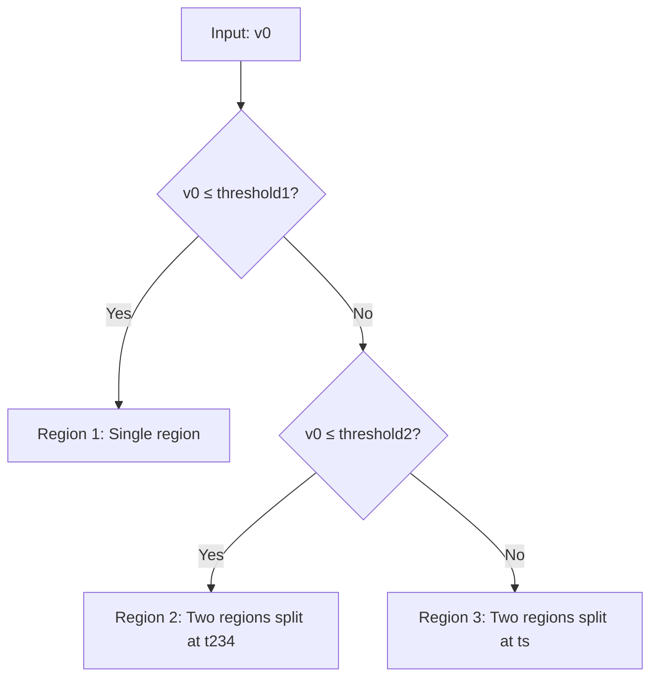

# Integration Module

> **Source**: [`src/helpers/utils.py`](../../../src/helpers/utils.py)  
> **Last Updated**: 2024-12-24

## Overview

The integration module provides numerical integration schemes and calculates the complex integration bounds required for runoff volume CDF computation, based on the physical catchment model.

---

## Functions

### `get_copula_families(copula_families)`

Factory function that returns copula constructors from the OpenTurns library.

| Parameter | Type | Description |
|-----------|------|-------------|
| `copula_families` | `list` | List of family names to retrieve |

**Supported Families**:
| Name | OpenTurns Class | Default Parameter |
|------|-----------------|-------------------|
| `"Gaussian"` | `NormalCopula` | ρ = 0.0 |
| `"t"` | `StudentCopula` | ρ = 0.0, df = 4 |
| `"Clayton"` | `ClaytonCopula` | θ = 1.0 |
| `"Gumbel"` | `GumbelCopula` | θ = 1.5 |
| `"Frank"` | `FrankCopula` | θ = 1.0 |

**Returns**: `dict` - Mapping of family names to constructor functions

---

### `get_integration_scheme(scheme, **kwargs)`

Returns the appropriate integration function based on the selected method.

| Parameter | Type | Description |
|-----------|------|-------------|
| `scheme` | `str` | Integration method name |
| `**kwargs` | dict | Method-specific parameters |

**Available Schemes**:

#### `ADAPTIVE_2D_QUADRATURE`
Uses `scipy.integrate.dblquad` for adaptive double integration.

| Kwarg | Type | Description |
|-------|------|-------------|
| `epsabs` | float | Absolute error tolerance |
| `epsrel` | float | Relative error tolerance |

#### `MONTE_CARLO`
Uses random sampling for integration approximation.

| Kwarg | Type | Description |
|-------|------|-------------|
| `n_samples` | int | Number of random samples |
| `random_state` | int | Random seed for reproducibility |

**Returns**: Callable with signature `(f, a, b, c, d) -> float`

---

### `get_runoff_integration_bounds(v0, params, v0_limit)`

Determines the integration bounds for runoff volume CDF based on the physical model.

| Parameter | Type | Default | Description |
|-----------|------|---------|-------------|
| `v0` | `float` | - | Target runoff volume |
| `params` | `dict` | - | Physical catchment parameters |
| `v0_limit` | `float` | `100.0` | Upper limit for time integration |

**Physical Parameters in `params`**:
| Key | Symbol | Description |
|-----|--------|-------------|
| `h` | h | Imperviousness fraction |
| `Sdi` | S_di | Impervious depression storage |
| `Sil` | S_il | Pervious initial loss |
| `fc` | f_c | Ultimate infiltration rate |
| `Sm` | S_m | Maximum infiltration storage |
| `ts` | t_s | Time to saturation |

**Returns**: List of bound dictionaries, each containing:
- `a(t)`: Lower bound function for outer integral
- `b(t)`: Upper bound function for outer integral
- `c(t)`: Lower bound function for inner integral (rainfall)
- `d(t)`: Upper bound function for inner integral (rainfall)

---

## Integration Region Logic

The integration bounds depend on which physical regime applies:



**Threshold Calculations**:
```
Sdd = Sil - Sdi           (Depression storage difference)
threshold1 = h × Sdd      (Low runoff threshold)
threshold2 = h × (Sdd + Sm)  (Medium runoff threshold)
t234 = (v0/h - Sdi) / (fc × (1-h))  (Transition time)
```

### Case 1: `0 ≤ v0 ≤ threshold1`
Small runoff volumes - single integration region.

### Case 2: `threshold1 < v0 ≤ threshold2`
Medium runoff - two regions with transition at `t234`.

### Case 3: `v0 > threshold2`
Large runoff - two regions with transition at saturation time `ts`.

---

## Usage Example

```python
from helpers.utils import get_integration_scheme, get_runoff_integration_bounds

# Get integration function
integrate = get_integration_scheme(
    "ADAPTIVE_2D_QUADRATURE",
    epsabs=1e-5,
    epsrel=1e-5
)

# Get bounds for specific runoff volume
params = {
    "h": 0.447, "Sdi": 0.049, "Sil": 5.20,
    "fc": 0.36, "Sm": 4.90, "ts": 13.6
}
bounds_list = get_runoff_integration_bounds(v0=3.0, params=params)

# Integrate over each region
total = 0
for bounds in bounds_list:
    result = integrate(
        joint_density,
        bounds['a'](0), bounds['b'](0),  # Time bounds
        bounds['c'], bounds['d']          # Rainfall bounds
    )
    total += result
```

---

## Configuration Reference

```yaml
integration:
  method: "ADAPTIVE_2D_QUADRATURE"
  kwargs:
    epsabs: 1.0e-5
    epsrel: 1.0e-5
    # For Monte Carlo:
    # n_samples: 200000
    # random_state: 42
```

---

## Tests

Test file: [`tests/test_utils.py`](../../../tests/test_utils.py)

| Test | Description |
|------|-------------|
| `test_condition_1_small_v0` | Low runoff threshold case |
| `test_condition_2_medium_v0` | Medium runoff threshold case |
| `test_condition_3_large_v0` | High runoff threshold case |
| `test_edge_case_v0_at_threshold1` | Boundary at threshold1 |
| `test_edge_case_v0_at_threshold2` | Boundary at threshold2 |
| `test_v0_zero` | Zero runoff case |
| `test_bounds_are_vectorized` | Array input handling |

Run tests:
```bash
python -m unittest tests.test_utils -v
```
