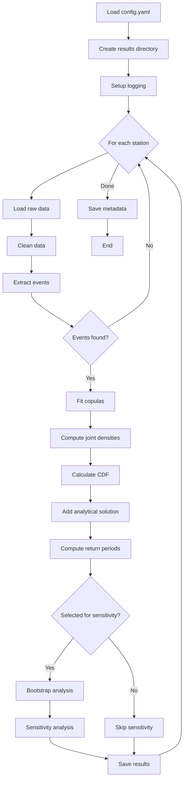

# Workflow Module

> **Source**: [`src/workflow.py`](../../../src/workflow.py)  
> **Last Updated**: 2024-12-24

## Overview

The workflow module is the main entry point that orchestrates the complete rainfall-runoff analysis pipeline. It coordinates preprocessing, copula fitting, CDF computation, and sensitivity analysis for one or more weather stations.

---

## Functions

### `setup_run_logging(save_path)`

Configures file-based logging in addition to console output.

| Parameter | Type | Description |
|-----------|------|-------------|
| `save_path` | `pathlib.Path` | Results directory |

**Creates**: `00_run_logs.log` in the results directory

---

### `collect_run_metadata(save_path)`

Captures execution environment for reproducibility.

| Parameter | Type | Description |
|-----------|------|-------------|
| `save_path` | `pathlib.Path` | Results directory |

**Returns**: `dict` with execution metadata

---

## Main Pipeline

The `if __name__ == "__main__"` block executes the full pipeline:



---

## Execution

### Basic Usage
```bash
cd src
python workflow.py
```

### Pipeline Steps

1. **Load Configuration**
   ```python
   with open("data/inputs/config.yaml", "r") as f:
       config = yaml.safe_load(f)
   ```

2. **Create Results Directory**
   ```python
   save_dir = preprocessing.create_save_dir(
       base_dir=config["postprocessing"]["save_path"],
       stations=config["database"]["stations_list"]
   )
   ```

3. **Process Each Station**
   - Load hourly rainfall data
   - Clean and filter data
   - Extract rainfall events
   - Fit copula families
   - Compute exponential rates (λ_v, λ_t)
   - Build joint density functions
   - Integrate for CDF values
   - Calculate return periods

4. **Optional Sensitivity Analysis**
   - Bootstrap uncertainty (if station selected)
   - Parameter sensitivity sweep

5. **Save Results**
   - All data files (CSV)
   - Run metadata (YAML)
   - Experiment parameters (YAML)
   - Execution logs

---

## Configuration

The workflow reads all parameters from `data/inputs/config.yaml`:

| Section | Purpose |
|---------|---------|
| `database` | Data source settings |
| `preprocessing` | Data cleaning parameters |
| `physics_model` | Catchment physical parameters |
| `integration` | Numerical integration settings |
| `analysis` | Return period settings |
| `sensitivity_analysis` | Bootstrap/sensitivity config |
| `copula_families` | Families to fit |
| `postprocessing` | Output settings |

See [config.yaml](../../../data/inputs/config.yaml) for full specification.

---

## Multi-Station Processing

The workflow automatically handles multiple stations:

```yaml
database:
  stations_list:
    - id: "6153301"
      name: "HAMILTON RBG CS"
    - id: "6139525"
      name: "WINDSOR A"
```

Results are organized by station:
```
results/MULTI-STATIONS -- timestamp -- uuid/
├── HAMILTON RBG CS - 6153301/
│   ├── 01_input_data/
│   └── 02_copula_fitting/
└── WINDSOR A - 6139525/
    ├── 01_input_data/
    └── 02_copula_fitting/
```

---

## Logging

The workflow uses Python's logging module with:
- **Console output**: Real-time progress
- **File output**: Persistent record in results

**Log format**:
```
2024-12-24 15:30:00 [INFO] workflow - Starting analysis for station: HAMILTON RBG CS (6153301)
```

---

## Error Handling

- Empty data after cleaning: Logs warning, continues to next station
- Database connection errors: Propagated with full traceback
- Integration warnings: Suppressed but noted in logs

---

## Extending the Workflow

To add new analysis steps:

1. Import your module in `workflow.py`
2. Add processing after copula fitting
3. Include results in `save_data()` datasets dict
4. Update this capsule documentation
