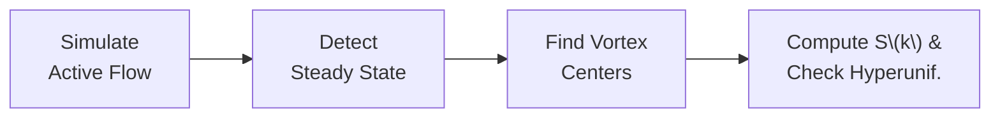

# Nonequilibrium Hyperuniform States in Active Turbulence

[](LICENSE)
[](https://www.python.org/downloads/)

> **Publication:**  
> *Nonequilibrium hyperuniform states in active turbulence*  
> Rainer Backofen, Abdelrahman Y. A. Altawil, Marco Salvalaglio, Axel Voigt

---

## Overview

This repository provides the **simulation and analysis code** for studying hyperuniform patterns emerging from active turbulence — a phenomenon observed in dense bacterial suspensions and other self-propelled matter.

### What is Active Turbulence?

Active fluids are materials composed of self-propelled entities (like bacteria) that convert stored energy into mechanical motion. Unlike conventional turbulence driven by external forces, **active turbulence** arises spontaneously from internal stresses generated by the swimmers themselves.

This creates a fascinating state:
- Chaotic flow patterns at small scales
- Jets and swirling vortices
- Complex collective behavior

### What is Hyperuniformity?

**Hyperuniformity** is a hidden order in seemingly disordered systems. While the vortex centers appear randomly distributed locally, they exhibit suppressed density fluctuations at large scales — more uniform than random chance would predict.

Mathematically, a system is hyperuniform if its structure factor:

$$S(k) \to 0 \quad \text{as} \quad k \to 0$$

This property is significant because it suggests that chaotic active flows can self-organize into globally ordered patterns, connecting non-equilibrium physics to crystallography.

### Why Does This Matter?

Understanding hyperuniformity in active systems has implications for:

- **Biophysics**: How bacterial colonies organize collectively
- **Materials Science**: Designing active materials with controlled properties  
- **Statistical Physics**: Non-equilibrium phase transitions and pattern formation
- **Soft Matter**: Self-organization in living systems

---

## What This Code Does

The project implements a complete pipeline:



1. **Simulation**: Solves the generalized Navier-Stokes equations with scale-dependent viscosity (PVC model)
2. **Steady State Analysis**: Identifies equilibrated flow configurations
3. **Extrema Search**: Locates vortex centers (local minima/maxima of vorticity)
4. **Hyperuniformity Analysis**: Computes structure factor S(k) and fits power-law exponents

---

## Project Structure

```
├── src/                          # Core simulation and analysis code
│   ├── simulation/               # PVC model solver (spectral method)
│   ├── steady_state_analysis/    # Equilibrium detection
│   ├── extrema_search/           # Vortex center identification
│   └── hyperuniformity_analysis/ # Structure factor computation
├── tests/                        # Pytest test suite
├── parameters/                   # YAML configuration files
├── notebooks/                    # Jupyter notebooks for exploration
├── docs/                         # Documentation
│   ├── theoretical_background.md # Mathematical foundations
│   └── capsules/                 # Module-specific docs
└── data/                         # Output data (gitignored)
```

---

## Documentation

| Document | Description |
|----------|-------------|
| [Theoretical Background](docs/theoretical_background.md) | Mathematical model and numerical methods |
| [Simulation](docs/capsules/simulation.md) | PVC model and spectral solver |
| [Steady State](docs/capsules/steady_state_analysis.md) | Equilibrium detection |
| [Extrema Search](docs/capsules/extrema_search.md) | Vortex center detection |
| [Hyperuniformity](docs/capsules/hyperuniformity_analysis.md) | Structure factor analysis |
| [Framework](docs/capsules/framework.md) | Architecture overview |

---

## Quick Start

```bash
# Install
pip install -e .

# Run complete pipeline (simulation + analysis)
cd src
python all_workflow.py

# Or run just the analysis on an existing simulation
python analysis_workflow.py
```

---

## Citation

> R. Backofen, A.Y.A. Altawil, M. Salvalaglio, & A. Voigt, Nonequilibrium hyperuniform states in active turbulence, Proc. Natl. Acad. Sci. U.S.A. 121 (24) e2320719121, https://doi.org/10.1073/pnas.2320719121 (2024).

---

## License

MIT License — see [LICENSE](LICENSE)
