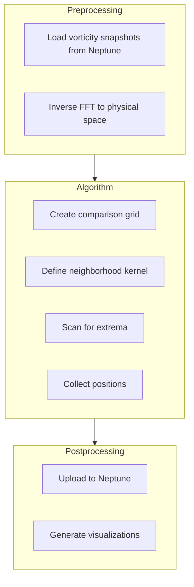

# Extrema Search Module

This module finds the **centers of vortices** in the flow field. These points are what we analyze for hyperuniformity.

---

## What Are Extrema?

In fluid dynamics, vortices are regions where the fluid spins. The **center** of each vortex is where:
- **Vorticity is maximum** (counterclockwise spin) — these are maxima
- **Vorticity is minimum** (clockwise spin) — these are minima

```
    Vorticity field          Extrema
    ┌─────────────┐         ┌─────────────┐
    │ ∿∿  ○  ∿∿   │         │      ●      │ ← maximum
    │   ╲   ╱     │   →     │             │
    │    ╳─●      │         │      ○      │ ← minimum
    │   ╱   ╲     │         │             │
    └─────────────┘         └─────────────┘
```

We extract these points to study their spatial arrangement.

---

## Why Does This Matter?

The key insight of this research is that vortex centers in active turbulence might be **hyperuniform** — arranged in a special pattern where:
- They look random locally
- But at large scales, they're more evenly distributed than random

To check this, we first need to find where all the vortex centers are. That's what this module does.

---

## The Algorithm

### Step 1: Load Vorticity Field

We start with ω̂(kx, ky) in Fourier space and transform back:

```python
ω(x, y) = inverse_fft(ω̂)
```

### Step 2: Define Neighborhood

For each grid point, we define its "neighbors" — the surrounding points:

```
    ┌───┬───┬───┐
    │ N │ N │ N │
    ├───┼───┼───┤
    │ N │ P │ N │  ← P is the point, N are neighbors
    ├───┼───┼───┤
    │ N │ N │ N │
    └───┴───┴───┘
```

### Step 3: Find Extrema

A point is a **local minimum** if:
```
ω(P) < ω(N) for ALL neighbors N
```

A point is a **local maximum** if:
```
ω(P) > ω(N) for ALL neighbors N
```

### Step 4: Record Positions

We save the (x, y) coordinates of all detected extrema.

---

## Workflow Diagram



---

## Configuration

Edit `parameters/extrema_search.yml`:

```yaml
preprocessing:
  experiment_ID: AC-456    # Run ID from steady state analysis
  download_path: ./data/extrema_search

algorithm:
  target: minima           # "minima" or "maxima"

postprocessing:
  save_path: ./data/extrema_search
```

**Choosing minima vs maxima:**
- Both should give similar hyperuniformity results
- Minima and maxima often occur in pairs
- Pick one and be consistent

---

## Running the Analysis

```bash
cd src/extrema_search
python workflow.py
```

---

## Output

### Extrema Positions

A list of (x, y) coordinates for each snapshot:

```
Snapshot 0: 342 extrema found
  (0.12, 2.31), (0.45, 1.67), (0.89, 0.23), ...

Snapshot 1: 339 extrema found
  (0.11, 2.29), (0.44, 1.68), (0.91, 0.25), ...
```

### Visualizations

#### Point Cloud Plot
Shows all extrema as dots:

```
    y
    ↑
    │   ·  ·     ·
    │      ·  ·     ·
    │  ·      ·  ·
    │    ·  ·     ·  
    └──────────────→ x
```

#### Scatter Over Contour (Interactive)
Extrema overlaid on the vorticity field — great for verification:

```
    ┌─────────────────┐
    │ ≋≋≋○≋≋≋●≋≋≋    │  ○ = minimum
    │ ≋≋≋≋≋≋≋≋≋≋●≋≋  │  ● = maximum
    │ ≋≋●≋≋≋≋≋≋○≋≋≋  │  ≋ = vorticity contours
    │ ≋≋≋≋≋○≋≋≋≋≋≋≋  │
    └─────────────────┘
```

#### 3D View
Interactive 3D plot of vorticity surface with extrema marked.

---

## How Many Extrema to Expect?

For typical parameters (N=128, k_min=33, k_max=40):
- Expect **300-400 extrema** per snapshot
- Should be roughly equal minima and maxima
- More active injection (higher v_ratio) → more vortices

---

## Troubleshooting

### "Too few extrema found"
- Check that simulation reached steady state
- Try the opposite target (minima ↔ maxima)

### "Extrema clustered in one region"
- Simulation might not be in steady state
- Check for numerical issues in simulation

---

## Related Documentation

- [Steady State Analysis](steady_state_analysis.md) — Previous step
- [Hyperuniformity Analysis](hyperuniformity_analysis.md) — Next step: analyze the point pattern
