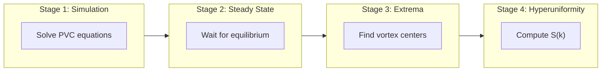
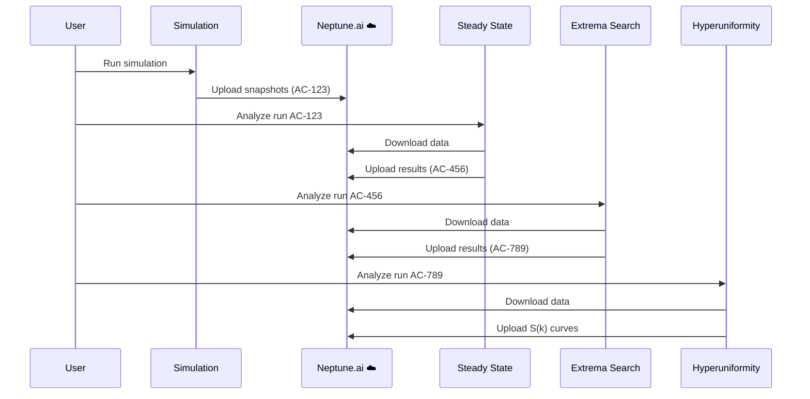

# Framework Overview

This document explains how the project is organized and how all the pieces fit together.

---

## What Does This Project Do?

This project studies **hyperuniformity in active turbulence**. In plain terms:

1. We simulate a special kind of fluid that drives itself (like a swarm of bacteria)
2. This fluid forms swirling patterns called vortices
3. We find the centers of these vortices
4. We check if these vortex centers are arranged in a special pattern called "hyperuniform"

**Hyperuniformity** is a fascinating type of order: the points look random up close, but at large scales, they're surprisingly uniform — more uniform than random chance would predict.

---

## The Analysis Pipeline

The project follows a clear four-stage pipeline:



Each stage produces data that feeds into the next stage. This modular design lets you:
- Run just the simulation if that's all you need
- Re-analyze existing simulation data with different settings
- Compare multiple analysis approaches

---

## Project Structure

Here's how the code is organized:

```
📁 Nonequilibrium hyperuniform states in active turbulence/
├── 📁 src/                       ← Main source code
│   ├── 📄 analysis_workflow.py   ← Runs the full pipeline
│   ├── 📁 simulation/            ← Stage 1
│   ├── 📁 steady_state_analysis/ ← Stage 2
│   ├── 📁 extrema_search/        ← Stage 3
│   └── 📁 hyperuniformity_analysis/ ← Stage 4
│
├── 📁 tests/                     ← Pytest test suite (66 tests)
├── 📁 parameters/                ← Configuration files
│   ├── 📄 simulation.yml
│   ├── 📄 steady_state_analysis.yml
│   ├── 📄 extrema_search.yml
│   └── 📄 hyperuniformity_analysis.yml
│
├── 📁 notebooks/                 ← Jupyter notebooks
├── 📁 docs/capsules/             ← Documentation (you are here!)
└── 📁 data/                      ← Output data (gitignored)
```

---

## Module Structure Pattern

Each analysis module follows the **same consistent pattern**:

```
📁 module_name/
├── 📄 __init__.py          ← Package marker
├── 📄 workflow.py          ← Entry point: orchestrates everything
├── 📄 preprocessing.py     ← Load and prepare data
├── 📄 algorithm_tasks.py   ← Core computations
├── 📄 postprocessing.py    ← Save results and plot
└── 📁 helpers/             ← Utility functions
```

This pattern makes it easy to:
- Find where specific logic lives
- Add new analysis modules
- Understand unfamiliar code quickly

---

## Data Flow Between Stages

Each stage reads from the previous stage via Neptune.ai:



**Key benefit:** All data is tracked in the cloud. You can:
- Resume work on any computer
- Share results with collaborators
- Compare different analysis runs

---

## Configuration System

All parameters are stored in YAML files (in `parameters/`). This keeps settings separate from code:

```yaml
# Example: parameters/simulation.yml
algorithm:
  discretization:
    domain_length: 3.141592653589793
    collocation_points_per_axis: 128
  physical:
    v_0: 0.0011
    v_ratio: 1
```

**Why YAML?**
- Human readable
- Easy to version control
- Can be edited without touching code

See the YAML files in `parameters/` for all available options.

---

## Key Scientific Concepts

### The PVC Model

We simulate "active matter" using the **Parity-Violating Crystal (PVC) model**. This describes fluids where:
- Energy is injected at certain length scales (k_min to k_max)
- Energy dissipates at other scales
- The result is sustained turbulent motion

### Hyperuniformity

A point pattern is **hyperuniform** if its structure factor S(k) → 0 as k → 0.

What does this mean physically?
- **Random points**: S(k) stays finite at small k (density fluctuates at all scales)
- **Hyperuniform points**: S(k) vanishes at small k (large-scale fluctuations are suppressed)

This is the key quantity we compute to characterize vortex patterns.

---

## Next Steps

- 📐 [Theoretical Background](../theoretical_background.md) — Mathematical foundations
- 🔬 [Simulation Module](simulation.md) — How the solver works
- 📊 [Hyperuniformity Analysis](hyperuniformity_analysis.md) — The science in detail
