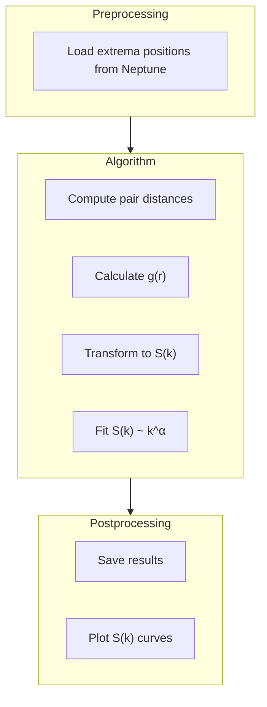

# Hyperuniformity Analysis Module

This is the final and most important analysis step. We compute the **structure factor S(k)** to determine if the vortex pattern is hyperuniform.

---

## What is Hyperuniformity?

Imagine dropping random points on a plane vs. arranging points on a grid:

```
Random Points          Regular Grid          Hyperuniform
┌─────────────┐       ┌─────────────┐       ┌─────────────┐
│ ·    ·  · · │       │ · · · · · · │       │  ·  ·   · · │
│  · ··       │       │ · · · · · · │       │ · ·  ·  ·   │
│      ·  ·   │       │ · · · · · · │       │  · ·  ·  ·  │
│ ·  ·   · ·  │       │ · · · · · · │       │ ·  · ·   ·  │
└─────────────┘       └─────────────┘       └─────────────┘
  Clustered             Too ordered          Just right!
```

**Hyperuniform** patterns are special: they appear random locally but have suppressed density fluctuations at large scales. They're "more uniform than random but less ordered than a crystal."

---

## The Structure Factor S(k)

The **structure factor** tells us about density fluctuations at different length scales:

- **k** = wavenumber (2π / wavelength)
- **S(k)** = amount of fluctuation at that scale

**Key signature of hyperuniformity:**

$$S(k) \to 0 \quad \text{as} \quad k \to 0$$

For hyperuniform systems, S(k) vanishes at small k (large scales):

```
  S(k)
   │                    Random: S(k) → const
   │ ╲                  ──────────────────
   │  ╲           
   │   ╲          Hyperuniform: S(k) → 0
   │    ╲              ───────
   │     ╲            ╱
   │      ╲__________╱
   └─────────────────────────── k
   0                            
```

---

## Classification by Exponent α

We fit S(k) ~ k^α at small k:

| Class | α Value | Physical Meaning |
|-------|---------|------------------|
| Class I | α > 1 | Strong hyperuniformity |
| Class II | α = 1 | Logarithmic fluctuations |
| Class III | 0 < α < 1 | Weak hyperuniformity |
| Not hyperuniform | α ≤ 0 | No suppression |

---

## How We Compute S(k)

### Step 1: Pair Distance Histogram

Count how many pairs of points are separated by distance r:

```python
for each pair of extrema (i, j):
    r = distance(i, j)
    histogram[r] += 1
```

### Step 2: Radial Distribution Function g(r)

Normalize by what we'd expect for random points:

$$g(r) = \frac{\text{observed pairs at distance } r}{\text{expected for random points}}$$

- g(r) = 1 means random behavior at that scale
- g(r) > 1 means points cluster at that distance
- g(r) < 1 means points avoid that distance

### Step 3: Structure Factor S(k)

Fourier transform the pair correlation:

$$S(k) = 1 + \rho \int [g(r) - 1] e^{-i k \cdot r} dr$$

For isotropic systems, this simplifies using Bessel functions.

---

## Workflow Diagram



---

## Configuration

Edit `parameters/hyperuniformity_analysis.yml`:

```yaml
preprocessing:
  experiment_ID: AC-789    # Run ID from extrema search
  download_path: ./data/hyperuniformity_analysis

algorithm:
  target: minima           # Match what you used in extrema search
  
  k_interval:              # Range for S(k) computation
    - 0
    - 10
  
  fitting_intervals_comparison:  # Try different fitting ranges
    - [0, 5]
    - [0, 10]
    - [0, 15]
    - [0, 20]
    - [0, 25]

postprocessing:
  save_path: ./data/hyperuniformity_analysis
```

**Why multiple fitting intervals?**

The fitted exponent α can depend on the k-range used. We compute fits for several ranges to check consistency.

---

## Running the Analysis

```bash
cd src/active_flow/hyperuniformity_analysis
python workflow.py
```

---

## Output

### S(k) Curves

The main result — structure factor vs wavenumber:

```
  S(k)
   │
 1 │         ●●●●●●●●●●●●
   │       ●●
   │     ●●
   │   ●●
   │ ●●
   │●
   └────────────────────── k
   0    5    10   15   20
   
   The dip at k → 0 indicates hyperuniformity!
```

### Power-Law Fits

Table of fitted exponents:

| k-range | Fitted α | R² |
|---------|----------|-----|
| [0, 5] | 1.23 | 0.98 |
| [0, 10] | 1.18 | 0.97 |
| [0, 15] | 1.12 | 0.95 |

A consistent α > 0 across ranges confirms hyperuniformity!

---

## Interpreting Results

### Strong Signal of Hyperuniformity
- S(k) clearly drops toward 0 as k → 0
- Fitted α is consistently > 0.5
- Results are stable across different k-ranges

### Weak or No Hyperuniformity
- S(k) flattens or increases at small k
- Fitted α is close to 0 or negative
- Results vary widely with fitting range

### What Affects Results?
- **Number of snapshots**: More data → better statistics
- **Simulation parameters**: Higher v_ratio often gives stronger hyperuniformity
- **System size**: Larger domains probe larger scales

---

## Tips for Good Results

1. **Use many snapshots** (10-20 from steady state)
2. **Average S(k)** across snapshots before fitting
3. **Check consistency** across fitting ranges
4. **Compare minima and maxima** — they should give similar α

---

## Example Interpretation

```
Results for v_ratio = 2:
- Fitted α = 1.15 ± 0.08
- Classification: Class I (strong hyperuniformity)
- Conclusion: Vortex centers exhibit suppressed large-scale fluctuations
```

---

## Related Documentation

- [Extrema Search](extrema_search.md) — How we find the points
- [Framework Overview](framework.md) — The big picture
- [Theoretical Background](../theoretical_background.md) — Mathematical foundations

