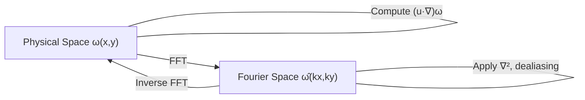
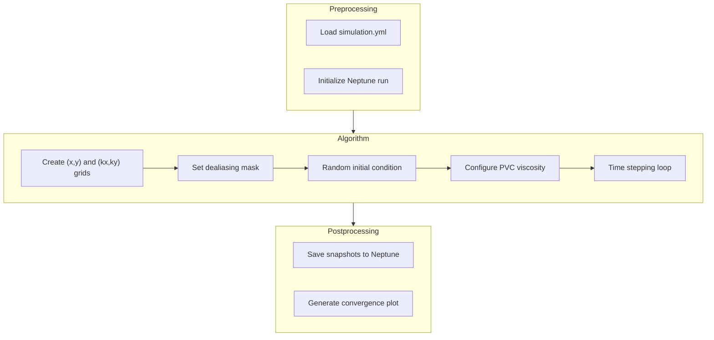

# Simulation Module

This module solves the active flow equations using a **spectral method**. It's the engine that generates the turbulent flow fields we analyze.

---

## What Does the Simulation Do?

We solve the **vorticity equation** for an active fluid:

```
∂ω/∂t + (u·∇)ω = ∇²(v_eff · ω)
```

Where:
- **ω** (omega) = vorticity (how much the fluid spins at each point)
- **u** = velocity field (which way the fluid flows)
- **v_eff** = effective viscosity (varies with wavenumber k)

The simulation starts from random noise and evolves until patterns emerge.

---

## The Numerical Method

We use a **pseudospectral method** — computations happen in two spaces:

| Space | What We Do There |
|-------|------------------|
| **Physical (x, y)** | Compute nonlinear terms (u·∇)ω |
| **Fourier (kx, ky)** | Apply linear operators, diffusion |

Going back and forth uses the **Fast Fourier Transform (FFT)**.



**Why spectral methods?**
- Very accurate for smooth problems
- Derivatives become multiplications in Fourier space
- FFT is O(N log N) — fast!

---

## Workflow Diagram



---

## Algorithm Steps Explained

### 1. Discretization

Create computational grids:

```python
# Physical space: 128 × 128 points on [0, π] × [0, π]
x, y = meshgrid(linspace(0, L, N), linspace(0, L, N))

# Fourier space: corresponding wavenumbers
kx, ky = meshgrid(fftfreq(N), fftfreq(N))
```

### 2. Dealiasing (2/3 Rule)

When we compute nonlinear products, high frequencies can "fold back" and corrupt results. We zero out the top 1/3 of frequencies:

```python
k_max = (2/3) * (N/2) * dk
dealias_mask = (kx² + ky²) < k_max²
```

### 3. Initial Conditions

Start with Gaussian random noise:

```python
ω = random.normal(0, 1, size=(N, N))
ω̂ = fft2(ω)  # Transform to Fourier space
```

### 4. PVC Model

The key physics! We set different viscosities at different scales:

```
v_eff(k) = v₀           if k < k_min      (stable at large scales)
         = -v_ratio*v₀  if k_min ≤ k ≤ k_max  (ENERGY INJECTION here!)
         = 10*v₀        if k > k_max      (strong damping at small scales)
```

The **negative viscosity** at intermediate scales drives the turbulence!

### 5. Time Stepping (RK3)

We advance in time using 3rd-order Runge-Kutta:

```
k₁ = Δt · f(ωⁿ)
k₂ = Δt · f(ωⁿ + k₁/2)
k₃ = Δt · f(ωⁿ - k₁ + 2k₂)
ωⁿ⁺¹ = ωⁿ + (k₁ + 4k₂ + k₃)/6
```

The time step Δt is adjusted automatically using the **CFL condition**:

```
Δt = Courant × Δx / max(|u|)
```

---

## Key Parameters

| Parameter | Symbol | Default | Description |
|-----------|--------|---------|-------------|
| `domain_length` | L | π | Physical size of the square domain |
| `collocation_points_per_axis` | N | 128 | Grid resolution (N×N points) |
| `iterations` | - | 100,000 | Number of time steps |
| `tau` | Δt₀ | 0.0001 | Initial time step |
| `courant` | C | 1 | CFL safety factor |
| `time_stepping_scheme` | - | RK3 | Integration method |
| `v_0` | v₀ | 0.0011 | Base viscosity |
| `v_ratio` | - | 1 | Ratio for energy injection (try 1, 2, 5) |
| `k_min` | - | 33 | Start of active wavenumber range |
| `k_max` | - | 40 | End of active wavenumber range |

---

## Output

### Snapshots

Vorticity ω̂(kx, ky) is saved every 1,000 iterations. These are complex arrays stored as `.npy` files.

### Monitoring Table

Every 100 iterations, we record:
- Iteration number
- Simulation time
- Time step Δt
- Maximum velocity |u|_max
- Energy E(k=1) at wavenumber 1

### Convergence Plot

A plot showing E(k=1) vs iteration helps verify steady state:

```
E(k=1)
  │     ╭──────────────────
  │    ╱
  │   ╱
  │  ╱
  │ ╱
  └─────────────────────── iteration
      ↑
   Transient    Steady state →
```

---

## Example Run

```bash
cd src/simulation
python workflow.py
```

Output:
```
iteration = 0000000  tau = 0.0001  E(k=1) = 0.00012...  U_max = 0.05...
iteration = 0000100  tau = 0.0001  E(k=1) = 0.00089...  U_max = 0.23...
iteration = 0000200  tau = 0.0001  E(k=1) = 0.00234...  U_max = 0.45...
...
```

---

## Tips for Running

1. **Start with defaults**: The default parameters are tuned to work well
2. **Monitor E(k=1)**: Should stabilize after ~10,000-50,000 iterations
3. **Increase resolution gradually**: 128→256→512 as you need more detail
4. **Check Neptune**: All runs are tracked with full parameters

---

## Related Documentation

- [Theoretical Background](../theoretical_background.md) — Mathematical foundations
- [Steady State Analysis](steady_state_analysis.md) — What to do with simulation output

